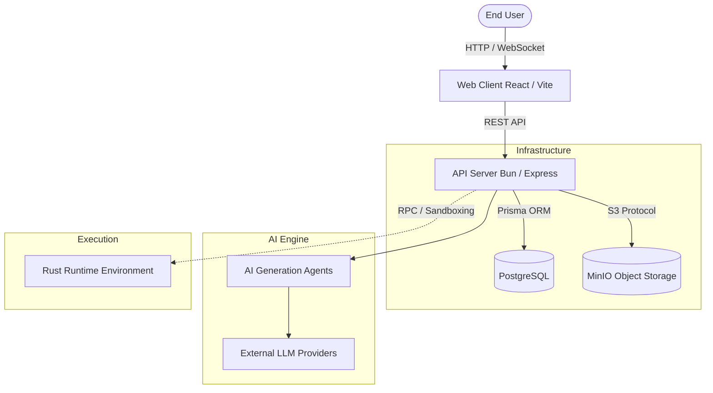
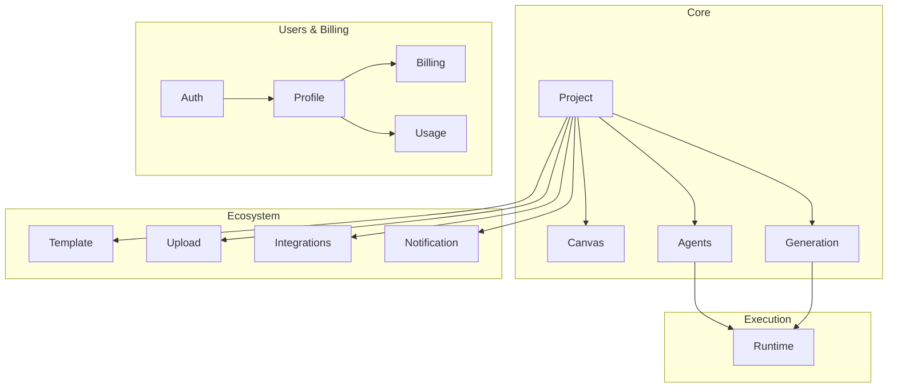
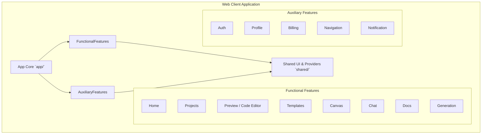
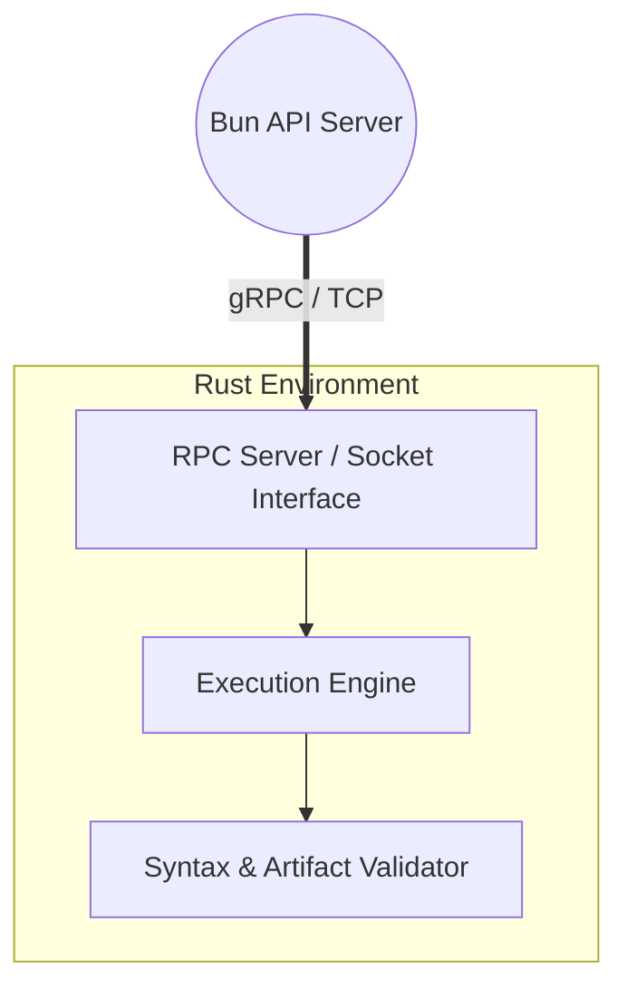
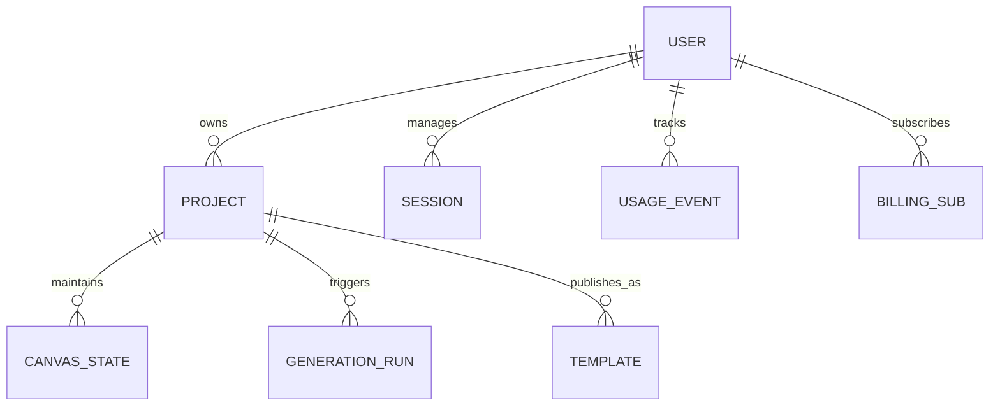

# December Architecture

December is a modern, modular monorepo combining a React frontend, a Bun/Express API backend, and a Rust runtime environment. This document outlines the system architecture in detail, mapping out the relationships between the core modules and the overarching infrastructure.

## High-Level System Overview

## 1. API Server (`server/src/`)

The backend is built with Bun, Express, and Prisma. It follows a modular monolith architecture where domain logic is strictly isolated into distinct folders under `modules/`. Each module encapsulates its own routing, business logic, and validation.

### Standard Module Structure

Each module (e.g., `project`, `auth`) typically contains:

- `*.routes.ts`: Express router definitions.
- `*.controller.ts`: Request parsing and HTTP response handling.
- `*.service.ts`: Core business logic and database transactions.
- `*.schema.ts`: Zod validation schemas for robust type-safety.
- `*.utils.ts`: Pure helper functions.

### Server Modules Breakdown

#### Core Modules

- **Agents (`modules/agents`)**: Houses `plan.agent.ts` and `build.agent.ts`. Interprets natural language intents to formulate application plans and orchestrate the generation of code.
- **Generation (`modules/generation`)**: Orchestrates the workflows that tie AI agents to the code generation pipeline, including repository management and patch application.
- **Project (`modules/project`)**: The central domain model. Manages project metadata, persists states, and handles S3/MinIO integrations for storing project archives and files.
- **Canvas (`modules/canvas`)**: Manages the collaborative state of the visual UI canvas, persisting element layouts and structural connections.

#### Identity & Monetization

- **Auth (`modules/auth`)**: Handles user registration, sessions, password management, and JWT validation.
- **Profile (`modules/profile`)**: Manages user profiles, preferences, and account settings.
- **Billing (`modules/billing`)**: Integrates with external payment gateways to manage subscriptions and invoices.
- **Usage (`modules/usage`)**: Tracks AI token utilization, API calls, and enforces limits based on billing tiers.

#### Extended Capabilities

- **Template (`modules/template`)**: Allows users to share their projects as reusable templates and explore community creations.
- **Integrations (`modules/integrations`)**: Connects December with third-party tools (e.g., GitHub, Vercel) for seamless deployments.
- **Upload (`modules/upload`)**: Handles raw asset and code uploads into MinIO.
- **Notification (`modules/notification`)**: Manages internal and email-based notifications for users.
- **Runtime (`modules/runtime`)**: Acts as the interface bridge between the Bun API server and the external Rust execution environment.

---

## 2. Web Client (`web/src/`)

The frontend is a React SPA powered by Vite and written in TypeScript. It is structured entirely around "features" to enforce strong domain boundaries and scalability.

### Feature-Driven Architecture

#### Functional Features

- **Preview (`features/preview`)**: The interactive code editor, preview window, and environment controls for inspecting generated apps.
- **Projects (`features/projects`)**: Project dashboards, settings, and lifecycle management.
- **Canvas (`features/canvas`)**: The visual node-based editor for manipulating project architectures before generation.
- **Generation (`features/generation`)**: The interface for triggering and tracking the status of AI code generation workflows.
- **Chat (`features/chat`)**: The conversation interface for talking to the AI agents and requesting patches.
- **Templates (`features/templates`)**: Browsing, searching, and remixing community templates.
- **Home (`features/home`)**: Landing page and user onboarding experience.
- **Docs (`features/docs`)**: Interactive documentation and help guides.

#### Auxiliary Features

- **Auth (`features/auth`)**: Login, signup, and password reset flows.
- **Profile (`features/profile`)**: User settings dashboard.
- **Billing (`features/billing`)**: Subscription management and usage visualization.
- **Navigation (`features/navigation`)**: Global sidebars, headers, and routing elements.
- **Notification (`features/notification`)**: Real-time alerts and toast management.

---

## 3. Rust Runtime (`runtime/src/`)

The Rust runtime provides an isolated, high-performance execution environment. It is crucial for safely executing generated code and running intensive artifact validations without blocking the main API thread.

- **Execution Engine**: Sandboxes and runs the code generated by the AI agents (e.g., executing Bun or Node.js sub-processes in a secure jail).
- **Validator**: Checks TypeScript syntax, Vite configuration validity, and structural integrity of the generated artifacts before they are marked as ready for the user.

---

## 4. Data & Infrastructure

December relies on a robust local and production infrastructure setup. Local development utilizes Docker containers for backing services.

### Storage Layers

- **PostgreSQL**: The primary relational data store. Managed exclusively through Prisma ORM.
- **MinIO**: S3-compatible object storage. Used to store generated application files, `.zip` archives, and user-uploaded assets (images, fonts).

### Entity Relationship Mapping

